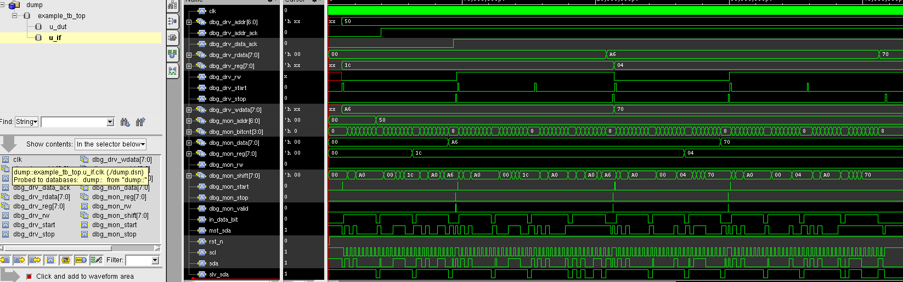

# I2C VIP

UVM-based I2C master VIP with a 256-byte I2C RAM slave DUT. Supports write, read, write-then-read-back, and bus scanning. Protocol checker assertions are in the interface.

---

## What it does

- **Write:** sends START + device addr + register addr + data byte + STOP
- **Read:** sends START + addr + reg addr + repeated START + addr + receives data + STOP
- **Scanner:** probes all 128 I2C addresses and prints a table of found devices
- **Write-read:** writes random bytes to random addresses then reads them back, scoreboard verifies

---

## How to run

```bash
cd scripts
chmod +x run_questa.sh run_xrun.sh clean.sh

./run_questa.sh    # Questa
./run_xrun.sh      # Xcelium
./clean.sh         # remove build artifacts
```

---

## Folder structure

```
i2c_vip/
├── if/
│   └── i2c_if.sv              interface, open-drain SDA, debug signals, assertions
│
├── common/
│   ├── i2c_seq_item.sv        one item = one I2C transaction (write/read/scan)
│   └── i2c_cfg.sv             config: clocks_per_bit, target addr, mode
│
├── agent/
│   ├── i2c_sequencer.sv       standard UVM sequencer
│   ├── i2c_driver.sv          I2C master, generates SCL, drives SDA
│   ├── i2c_monitor.sv         watches SCL/SDA, decodes transactions
│   └── i2c_agent.sv           puts it all together
│
├── seq/
│   ├── i2c_write_seq.sv       write one byte to one register address
│   ├── i2c_read_seq.sv        read one byte from one register address
│   ├── i2c_rw_seq.sv          write then read back N times (scoreboard friendly)
│   └── i2c_scanner_seq.sv     scan all 128 addresses, print result table
│
├── env/
│   ├── i2c_scoreboard.sv      shadow RAM tracks writes, verifies reads
│   └── i2c_env.sv             agent + scoreboard, connects analysis ports
│
├── tests/
│   └── i2c_rw_test.sv         runs write/read test
│
├── example_dut/
│   └── i2c_ram_dut.sv         256-byte I2C slave RAM, address param SLAVE_ADDR
│
├── tb/
│   └── example_tb_top.sv      top module, open-drain SDA wiring, wave dump
│
├── scripts/
│   ├── run_questa.sh
│   ├── run_xrun.sh
│   ├── clean.sh
│   ├── files.f
│   └── how_to_run.txt
│
└── i2c_vip_pkg.sv             package, includes everything in right order
```

---

## Compile order

```
1. i2c_if.sv
2. i2c_vip_pkg.sv
3. i2c_ram_dut.sv
4. example_tb_top.sv
```

---

## Open-drain SDA

Real I2C uses open-drain SDA — both master and slave can pull it low, neither can drive it high. In simulation this is handled with wired-AND in the interface:

```sv
wire sda = mst_sda & slv_sda;
// 1 = releasing (letting pull-up take it high)
// 0 = actively pulling low
```

VIP driver drives `mst_sda`. DUT drives `slv_sda`. Both read `sda`.

---

## Protocol checker assertions

The interface has four assertions:

| Assertion | What it checks |
|-----------|---------------|
| chk_start_condition | SDA fell while SCL was LOW (bus contention) |
| chk_sda_stable | SDA changed while SCL high during data transfer |
| chk_scl_no_glitch | SCL went high then immediately low (glitch) |
| chk_idle_after_reset | Bus not idle (both lines high) after reset |

---

## Debug signals in wave

| Signal | What it shows |
|--------|--------------|
| u_if.scl | I2C clock |
| u_if.sda | resolved SDA bus |
| u_if.dbg_drv_addr | device address driver is targeting |
| u_if.dbg_drv_rw | 0=write 1=read |
| u_if.dbg_drv_reg | register address being accessed |
| u_if.dbg_drv_wdata | byte being written |
| u_if.dbg_drv_start | pulse on each START |
| u_if.dbg_drv_stop | pulse on each STOP |
| u_if.dbg_mon_shift | byte building up bit by bit in monitor |
| u_if.dbg_mon_bitcnt | which bit the monitor is on |
| u_if.dbg_mon_data | fully decoded byte |
| u_if.dbg_mon_valid | pulse when full transaction captured |
| u_if.dbg_scan_addr | address being probed during scan |
| u_if.dbg_scan_found | pulse when a device is found |
| u_dut.state | DUT slave FSM state |
| u_dut.reg_ptr | current RAM address pointer |
| u_dut.shift_reg | incoming bits shifting in |

---

## DUT parameters

| Parameter | Default | Description |
|-----------|---------|-------------|
| SLAVE_ADDR | 7'h50 | I2C slave address |

---

## clocks_per_bit

Controls I2C speed. Formula: `baud = clk_freq / clocks_per_bit`

Example with 100 MHz clock:

```
clocks_per_bit = 20   -> 5 MHz    (simulation, fast)
clocks_per_bit = 250  -> 400 kHz  (Fast mode)
clocks_per_bit = 1000 -> 100 kHz  (Standard mode)
```

Keep it small in simulation. Does not matter what the actual frequency is as long as DUT and VIP use the same value.

---

## First version limitations

- Single master only
- Single byte data per transaction (no burst)
- No clock stretching
- No 10-bit addressing
- No functional coverage
- No multi-slave test (scanner finds them but no coordinated test)

All extendable without restructuring.

# Example Test Case and Waveform

## Test: `i2c_rw_test`

This test performs a **write → readback verification flow** using the I2C VIP.  
Two different register locations are written with random data and then read back to verify correct DUT behavior.

Sequence flow:

1. Write `0xA6` to register `0x1C`
2. Read back register `0x1C`
3. Write `0x70` to register `0x04`
4. Read back register `0x04`

The scoreboard keeps a **shadow RAM** and verifies the read data against the expected value.

---

## Simulation Log

<details>
<summary>📋 xrun simulation log </summary>

```
UVM_INFO @ 0: reporter [RNTST] Running test i2c_rw_test...
UVM_INFO ../tb/example_tb_top.sv(36) @ 100000: reporter [TB_TOP] Reset deasserted
UVM_INFO ../tests/i2c_rw_test.sv(38) @ 995000: uvm_test_top [i2c_rw_test] Starting RW test...
UVM_INFO ../agent/i2c_monitor.sv(182) @ 8975000: uvm_test_top.env.agent.mon [i2c_monitor] [TXN1] after data/rSTART recv: stop_seen=0 rstart=0 data=8'ha6
UVM_INFO ../env/i2c_scoreboard.sv(56) @ 9555000: uvm_test_top.env.sb [i2c_scoreboard] WRITE PASS [1] reg=8'h1c data=8'ha6(10100110)
UVM_INFO ../agent/i2c_monitor.sv(252) @ 9555000: uvm_test_top.env.agent.mon [i2c_monitor] Captured: WRITE  addr=7'h50  reg=8'h1c  data=8'ha6(10100110)  addr_ack=1 reg_ack=0 data_ack=1
UVM_INFO ../agent/i2c_driver.sv(162) @ 9625000: uvm_test_top.env.agent.drv [i2c_driver] WRITE done: WRITE  addr=7'h50  reg=8'h1c  data=8'ha6(10100110)  addr_ack=1 reg_ack=1 data_ack=1
UVM_INFO ../seq/i2c_rw_seq.sv(34) @ 9625000: uvm_test_top.env.agent.seqr@@seq [i2c_rw_seq] Wrote 8'ha6 -> reg[8'h1c]
UVM_INFO ../agent/i2c_monitor.sv(182) @ 15555000: uvm_test_top.env.agent.mon [i2c_monitor] [TXN2] after data/rSTART recv: stop_seen=0 rstart=1 data=8'h00
UVM_INFO ../agent/i2c_monitor.sv(193) @ 15555000: uvm_test_top.env.agent.mon [i2c_monitor] [TXN2] rSTART detected, entering READ path
UVM_INFO ../agent/i2c_monitor.sv(225) @ 21045000: uvm_test_top.env.agent.mon [i2c_monitor] [TXN2] NACK done, stop_seen=0, going to wait_for_stop
UVM_INFO ../agent/i2c_monitor.sv(231) @ 21305000: uvm_test_top.env.agent.mon [i2c_monitor] Captured: READ   addr=7'h50  reg=8'h1c  data=8'ha6(10100110)  addr_ack=1 reg_ack=0
UVM_INFO ../env/i2c_scoreboard.sv(79) @ 21305000: uvm_test_top.env.sb [i2c_scoreboard] READ  PASS [2] reg=8'h1c data=8'ha6(10100110)
UVM_INFO ../env/i2c_scoreboard.sv(79) @ 21315000: uvm_test_top.env.sb [i2c_scoreboard] READ  PASS [3] reg=8'h1c data=8'ha6(10100110)
UVM_INFO ../agent/i2c_monitor.sv(252) @ 21315000: uvm_test_top.env.agent.mon [i2c_monitor] Captured: READ   addr=7'h50  reg=8'h1c  data=8'ha6(10100110)  addr_ack=1 reg_ack=0
UVM_INFO ../agent/i2c_driver.sv(201) @ 21385000: uvm_test_top.env.agent.drv [i2c_driver] READ done: READ   addr=7'h50  reg=8'h1c  data=8'ha6(10100110)  addr_ack=1 reg_ack=1
UVM_INFO ../seq/i2c_rw_seq.sv(47) @ 21385000: uvm_test_top.env.agent.seqr@@seq [i2c_rw_seq] Read  8'ha6 <- reg[8'h1c]  (expected 8'ha6)     MATCH
UVM_INFO ../agent/i2c_monitor.sv(182) @ 29365000: uvm_test_top.env.agent.mon [i2c_monitor] [TXN3] after data/rSTART recv: stop_seen=0 rstart=0 data=8'h70
UVM_INFO ../env/i2c_scoreboard.sv(56) @ 29945000: uvm_test_top.env.sb [i2c_scoreboard] WRITE PASS [4] reg=8'h04 data=8'h70(01110000)
UVM_INFO ../agent/i2c_monitor.sv(252) @ 29945000: uvm_test_top.env.agent.mon [i2c_monitor] Captured: WRITE  addr=7'h50  reg=8'h04  data=8'h70(01110000)  addr_ack=1 reg_ack=0 data_ack=1
UVM_INFO ../agent/i2c_driver.sv(162) @ 30015000: uvm_test_top.env.agent.drv [i2c_driver] WRITE done: WRITE  addr=7'h50  reg=8'h04  data=8'h70(01110000)  addr_ack=1 reg_ack=1 data_ack=1
UVM_INFO ../seq/i2c_rw_seq.sv(34) @ 30015000: uvm_test_top.env.agent.seqr@@seq [i2c_rw_seq] Wrote 8'h70 -> reg[8'h04]
UVM_INFO ../agent/i2c_monitor.sv(182) @ 35945000: uvm_test_top.env.agent.mon [i2c_monitor] [TXN4] after data/rSTART recv: stop_seen=0 rstart=1 data=8'h00
UVM_INFO ../agent/i2c_monitor.sv(193) @ 35945000: uvm_test_top.env.agent.mon [i2c_monitor] [TXN4] rSTART detected, entering READ path
UVM_INFO ../agent/i2c_monitor.sv(225) @ 41435000: uvm_test_top.env.agent.mon [i2c_monitor] [TXN4] NACK done, stop_seen=0, going to wait_for_stop
UVM_INFO ../agent/i2c_driver.sv(201) @ 41775000: uvm_test_top.env.agent.drv [i2c_driver] READ done: READ   addr=7'h50  reg=8'h04  data=8'h70(01110000)  addr_ack=1 reg_ack=1
UVM_INFO ../seq/i2c_rw_seq.sv(47) @ 41775000: uvm_test_top.env.agent.seqr@@seq [i2c_rw_seq] Read  8'h70 <- reg[8'h04]  (expected 8'h70)     MATCH
UVM_INFO ../tests/i2c_rw_test.sv(48) @ 81775000: uvm_test_top [i2c_rw_test] Test done.
UVM_INFO /tools/cds/xlm/xlm24.03.006.lnx86/tools/methodology/UVM/CDNS-1.1d/sv/src/base/uvm_objection.svh(1268) @ 81775000: reporter [TEST_DONE] 'run' phase is ready to proceed to the 'extract' phase
UVM_INFO ../env/i2c_scoreboard.sv(106) @ 81775000: uvm_test_top.env.sb [i2c_scoreboard] 
--------------------------------------
  Scoreboard Summary
  PASS   : 4
  FAIL   : 0
  Writes : 2
  Reads  : 2
  Scans  : 0

```

</details>

All read transactions matched the expected data stored in the scoreboard shadow memory.

---

# Example Waveform



The waveform above shows the I2C transactions generated during the `i2c_rw_test`.

### Key signals

| Signal | Description |
|------|------|
| `scl` | I2C clock generated by the VIP driver |
| `sda` | resolved open-drain data line |
| `dbg_drv_addr` | address targeted by the driver |
| `dbg_drv_reg` | register address being accessed |
| `dbg_drv_wdata` | write data byte |
| `dbg_mon_shift` | monitor shift register capturing bits |
| `dbg_mon_data` | fully decoded data byte |
| `dbg_mon_valid` | pulse when a transaction is decoded |

---

## Waveform Transaction Breakdown

### Transaction 1 — WRITE


The monitor reconstructs the transaction and sends it to the scoreboard.  
The scoreboard updates its shadow RAM.

---

### Transaction 2 — READ

The DUT returns the previously written data (`0xA6`).  
The scoreboard compares it with the stored shadow RAM value → **PASS**.

---

### Transaction 3 — WRITE

Shadow RAM is updated with `0x70` at address `0x04`.

---

### Transaction 4 — READ

Returned data matches the expected value → **PASS**.

---

## Result

The test verifies:

- correct **I2C protocol sequencing**
- correct **slave register access**
- correct **monitor decoding**
- correct **scoreboard comparison**

All transactions passed successfully.
